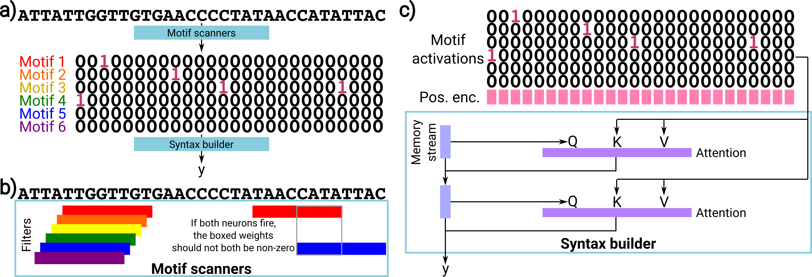

# ARGMINN: Analysis of Regulatory Genomics with a Mechanistically Interpretable Neural Network

<p align="center">
    
</p>

### Introduction

Deep neural networks excel in mapping regulatory DNA sequences to associated readouts (e.g. protein binding measured by ChIP-seq, or accessibility measured by DNase-seq). Beyond predictive performance, a major goal of these models is to reveal the motifs and syntax that drive genome regulation.

Previous methods have tried to interpret individual first-layer convolutional filters as motifs, but this tends to fail because most neural networks learn information in a distributed fashion, so motifs tend to be split across many filters and layers. Other methods which discover motifs by clustering importance scores bypass this problem, but suffer from the unreliability and instability that is inherent to importance scores (as well as clustering).

Instead, ARGMINN (Analysis of Regulatory Genomics with a Mechanistically Interpretable Neural Network) is a carefully designed neural-network architecture (along with special regularization) such that after training, the motifs and syntax are directly readable from the model's weights and activations. This allows ARGMINN to reveal motifs and syntax clearly without relying on importance scores.

See the corresponding paper for more information, including a full description of the ARGMINN architecture, comparisons and benchmarks on its interpretability and performance, and theoretical properties.

This repository houses all of the code used to generate the results for the paper, including code that processes data, trains models, implements ARGMINN models, and generates all figures in the paper.

### Getting started with ARGMINN

To apply the ARGMINN architecture to your own datasets for motif/syntax discovery, see [examples/argminn_example.ipynb](examples/argminn_example.ipynb).

This notebook is meant to be an entirely self-contained example of how to use the ARGMINN architecture. As such, the architecture is defined entirely within this notebook. External dependencies can be installed using the included Makefile, or manually.

### Citing this work

If you found ARGMINN to be helpful for your work, please cite the following:

Tseng, A.M., Eraslan, G., Biancalani, T., Scalia, G. A mechanistically interpretable neural network for regulatory genomics. arXiv (2024).

### Description of files and directories

```
├── Makefile    <- Installation of dependencies
├── examples    <- Jupyter notebooks that show tutorials/examples of how to use ARGMINN
├── data    <- Contains data for training and downstream analysis
│   ├── raw    <- Raw data, directly downloaded from the source
│   ├── interim    <- Intermediate data mid-processing
│   ├── processed    <- Processed data ready for training or analysis
│   └── README.md    <- Description of data
├── notebooks    <- Jupyter notebooks that explore data, plot results, and analyze results
│   └── figures    <- Jupyter notebooks that create figures
├── README.md    <- This file
└── src    <- Source code
    ├── feature    <- Code for data loading and featurization
    ├── model    <- Code for model architectures
    ├── train    <- Code for training models and evaluating predictive performance
    ├── extract    <- Code for extracting importance scores
    ├── analysis    <- Code for analyzing motifs and results
    └── plot    <- Code for plotting and visualization
```
